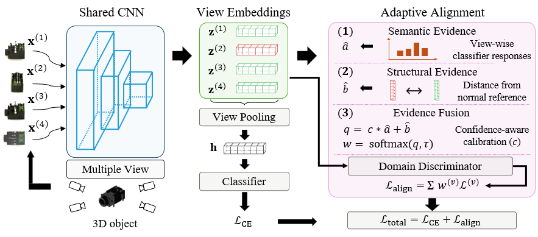
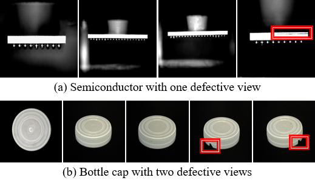
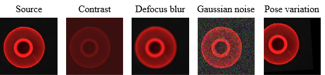

# MAA: Defect-Aware Multi-View Adaptive Alignment

Code for target-scarce, multi-view defect classification with defect-aware view-wise
domain alignment (MAA), evaluated on a plastic subset of **Real-IAD** under
corruption-based domain shift. This repository implements the **multi-class**
(5-class) setup: a shared ResNet-34 multi-view backbone (MVCNN-style, mean pooling)
plus DANN-based adaptation whose per-view alignment weights are set from
confidence-calibrated defect evidence.

## Overview

MAA estimates per-view defect relevance from two complementary cues — semantic
evidence (view-wise classifier responses) and structural evidence (deviation from a
domain-specific normal reference) — fuses them with confidence-aware calibration,
and applies the resulting view-wise weights only to the domain-alignment branch.
Normal samples are aligned uniformly, whereas defect samples are aligned mainly
through defect-relevant views.



## Problem setting

In multi-view 3D inspection, a defect is often visible in only a subset of views,
and the number of defect-visible views varies across samples. Under uniform
alignment, defect-irrelevant views can dominate the adaptation signal, which
motivates view-wise, defect-aware alignment.



*Defects (red boxes) appear only in certain views.*

## Requirements

The code depends on only a small set of packages. Versions below are the tested
configuration (CUDA 11.8 build of PyTorch).

| Package | Tested version |
|---|---|
| Python | ≥ 3.9 |
| torch | 2.1.2+cu118 |
| torchvision | 0.16.2+cu118 |
| numpy | 1.23.1 |
| pillow | 11.3.0 |
| scikit-learn | 1.6.1 |
| tqdm | 4.67.1 |
| imagecorruptions | latest |

Install:

```bash
# PyTorch (CUDA 11.8 build)
pip install torch==2.1.2+cu118 torchvision==0.16.2+cu118 \
  --index-url https://download.pytorch.org/whl/cu118

# Remaining dependencies
pip install numpy==1.23.1 pillow==11.3.0 scikit-learn==1.6.1 tqdm==4.67.1 imagecorruptions
```

Notes:
- `imagecorruptions` is required only for the ImageNet-C corruptions
  (e.g. `gaussian_noise`, `defocus_blur`, `contrast`). The pose corruption
  (`--corruption transforms`) and `--corruption none` do not need it.
- A CUDA-capable GPU is used when available; otherwise the code falls back to CPU.

## Dataset

We use the official **Real-IAD** dataset
(<https://huggingface.co/datasets/Real-IAD/Real-IAD>) and only the following
five plastic categories:

```
bottle_cap, eraser, plastic_nut, plastic_plug, regulator
```

Real-IAD provides 5 viewpoints per object. Each object is one sample folder
containing its view images.

### Expected directory layout

`--data_root` must point to a folder with the structure below. Each category
contains defect-type subfolders, and each defect-type folder contains sample
folders of multiple view images:

```
<data_root>/
├── bottle_cap/
│   ├── OK/                 # normal   -> label 0
│   │   ├── S0001/          # one object = one folder of view images
│   │   │   ├── *.jpg       # multiple views (Real-IAD: 5 viewpoints)
│   │   │   └── ...
│   │   └── ...
│   ├── AK/                 # defect   -> label 1
│   ├── HS/                 # defect   -> label 2
│   ├── QS/                 # defect   -> label 3
│   └── ZW/                 # defect   -> label 4
├── eraser/
├── plastic_nut/
├── plastic_plug/
└── regulator/
```

Label mapping (from `main_iad.py`):

```
OK -> 0 (normal),  AK -> 1,  HS -> 2,  QS -> 3,  ZW -> 4
```

`OK` is the normal class; `AK/HS/QS/ZW` are Real-IAD defect-type folder codes and
form defect classes 1–4. The source domain uses clean images; the target domain
is built by applying a corruption to a held-out split (see below).



*The target domain is constructed by applying corruptions (e.g. contrast, defocus
blur, Gaussian noise, pose) to the clean images.*

## Usage

### Single run

```bash
python main_iad.py \
  --data_root ./Real-IAD_plastic \
  --method maa \
  --seed 0 \
  --target_domain_ratio 0.5 \
  --corruption gaussian_noise \
  --severity 3 \
  --corrupt_p 1.0 \
  --corrupt_deterministic \
  --corrupt_seed 0
```

### Batch runs

`run_iad.sh` sweeps several corruptions and seeds:

```bash
bash run_iad.sh
```

### Pose corruption

Pose variation (rotation + translation) is available via the `transforms`
corruption. At `--severity 5` it applies up to ±30° rotation and ±20% translation:

```bash
python main_iad.py --data_root ./Real-IAD_plastic --method maa \
  --corruption transforms --severity 5 --corrupt_deterministic --corrupt_seed 0
```

### Key arguments

| Argument | Default | Description |
|---|---|---|
| `--data_root` | `./Real-IAD` | Dataset root (see layout above) |
| `--method` | (required) | Method name; use `maa` |
| `--align_loss` | `dann` | Alignment objective: `dann`, `coral`, or `mmd` |
| `--target_domain_ratio` | `0.5` | Fraction of all samples assigned to the target domain |
| `--target_frac` | `0.2` | Fraction of the target domain used as labeled target-train |
| `--corruption` | `gaussian_noise` | ImageNet-C name, `transforms` (pose), or `none` |
| `--severity` | `5` | Corruption severity (1–5) |
| `--corrupt_p` | `1.0` | Probability of applying the corruption |
| `--corrupt_deterministic` | off | Deterministic corruption per (sample, view) |
| `--corrupt_seed` | `1234` | Base seed for deterministic corruption |
| `--num_views` | `5` | Views per object |
| `--pool` | `mean` | View pooling (`mean` or `max`) |
| `--tau_orc` | `1.0` | Temperature for the view-weight softmax |
| `--multiplier` | `4.0` | Target-supervision weight (λ_t) |
| `--epochs` | `15` | Training epochs |
| `--batch_size` | `64` | Combined source+target batch size |
| `--lr` | `1e-4` | Learning rate (Adam) |
| `--seed` | `0` | Random seed |

## Outputs

Each run writes to `./runs_real/<corruption>/<seed>/`:

- `split.json` — sample keys per split and the run configuration
- `history.json` — per-epoch train/val metrics
- `best.pt`, `last.pt` — checkpoints (best is chosen by target validation macro-AUROC)
- `result.json` — final source/target test metrics

Evaluation reports accuracy, macro one-vs-rest AUROC (`macro_auroc`), and macro
AUPR; model selection uses target validation `macro_auroc`.

## Files

| File | Purpose |
|---|---|
| `main_iad.py` | Dataset indexing/splitting, training loop, evaluation, entry point |
| `methods.py` | MAA (view-wise weighting) and alignment losses (DANN / CORAL / MMD) |
| `models.py` | ResNet-34 backbone and MVCNN multi-view classifier |
| `datasets.py` | Transforms and the corruption wrapper (ImageNet-C + pose) |
| `run_iad.sh` | Example multi-corruption / multi-seed launcher |

## Citation

```bibtex
@article{kim2026maa,
  title   = {Defect-Aware Multi-View Adaptive Alignment for Defect Inspection in Target-Scarce Domain Adaptation},
  author  = {Kim, Seonggyeom and Park, Byeongtae and Chae, Dong-Kyu and Joung, Junegak},
  journal = {Advanced Engineering Informatics},
  volume  = {76},
  pages   = {105071},
  year    = {2026},
  doi     = {10.1016/j.aei.2026.105071},
  url     = {https://www.sciencedirect.com/science/article/pii/S1474034626007639}
}
